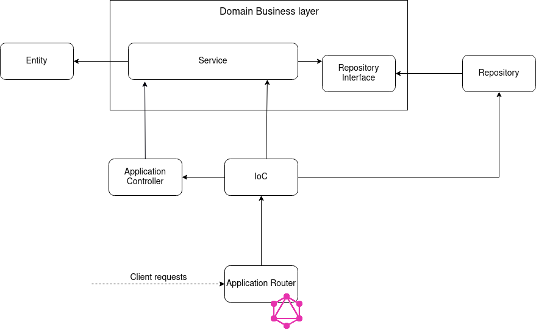
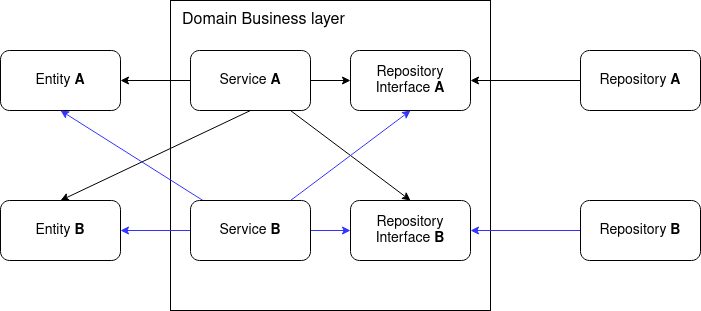

# GraphQL + Clean Architectire boilerplate

I wrote an article about this boilerplate at:
- Medium: https://congtuanle.medium.com/graphql-clean-architectire-boilerplate-1beb07935b41
- Or dev.to: https://dev.to/tuanlc/graphql-clean-architectire-boilerplate-hog

Discussion & Comments are warmly welcomed!

Feel free to send PRs to improve this repository. I hope this work will save time for you and the people in the community who are considering to adopt Graphql + Typescript + Clean Architeture.

## Inspiration
The [Clean Architecture](https://blog.cleancoder.com/uncle-bob/2012/08/13/the-clean-architecture.html) is an awesome guide for developers who desire to build a clean, structured and maintainable projects. The letter L in SOLID principal allows us to make depended components are easily replaced without touch to the business and the core of systems. For example of the web server where there are many frameworks out there (Expressjs, GraphQL, etc) and the chosen decision depends on the purpose of the business and the context.

In this boilerplate guide scope we will go throght how to make the core business immune with the change of the detailed technologies. Let's go!

## Boilerplate
### Code structure
```
.
├── package.json
├── package-lock.json
├── README.md
├── src
│   ├── application
│   │   ├── auth
│   │   │   └── index.ts
│   │   ├── graphql
│   │   │   ├── index.ts
│   │   │   ├── schemaShards
│   │   │   │   ├── index.ts
│   │   │   │   └── users.ts
│   │   │   ├── subscriptionManager.ts
│   │   │   └── utils
│   │   │       └── mergeRawSchemas.ts
│   │   └── index.ts
│   ├── dto
│   │   └── user.dto.ts
│   ├── entities
│   │   └── user.entity.ts
│   ├── index.ts
│   ├── IoC
│   │   ├── container.ts
│   │   ├── icradle.interface.ts
│   │   └── providers
│   │       ├── auth.provider.ts
│   │       └── user.provider.ts
│   ├── persistence
│   │   ├── auth.repository.ts
│   │   ├── constants.ts
│   │   ├── password.ts
│   │   └── user.repository.ts
│   ├── services
│   │   ├── auth.repository.interface.ts
│   │   ├── auth.service.ts
│   │   ├── user.repository.interface.ts
│   │   └── user.service.ts
│   └── __typedefs
│       ├── graphqlTypes.d.ts
│       └── schema.graphql
└── tsconfig.json
```

The main folder is `src` where contains the implementation:
- **application**: Application layer where we can use a backend web application framework. In this boilerplate is `GraphQL`
- **service**: The business service layer where we defined the logic to handle application usecases. This layers also contains adapters that abstract the detailed actions, for example, access to database.
- **entities**: This is the corest component of the application where we define the application entities.
- **persistence**: This is another detailed layer where we specify actions to communicate to database, message queue, etc.
- **dto**: (stand for Data Transfer Object) defines communication contracts between layers. For example, what type of input params or returned value that is used in methods of layers
- **IoC**: (stand for Iversion of Control) is an implementation of the Dependency Injection, the letter D in the SOLID principal. Everytime you create a new Service class, or a new repository class, or a new controller, you need to register them in this container. This boilerplate uses [Awilix](https://github.com/jeffijoe/awilix) library to achieve the factor.

### Communication Policies
The communication policies between layers and domains compliant with the Clean Architecture. The directions of arrows in the following diagrams show the relation between components. For example, if an arrow direction from component X to component Y, it means component X depends on the component Y.

1. Dependency diagram


As you can see in the diagram the dependency flow among layers:
- Entity is the core layer and does not depend on any component
- To inverse the dependency from the domain business layer to the repository layer, there is a repository interface in the domain business. This allows us to be able to implement and update this layer with the detailed technologies
- Application Controller depends in the services
- IoC container depends on services, repositories and application controllers because we need to register all of them to the container
- Application router depends on the IoC container that allows us to use registered application controllers to handle client requests

2. Dependency between domains


In real-life projects, of course, there is not merely 1 domain. So, we need to define the communication rules between layers of them. 

## Getting Started
There are some beginning available commandlines is defined the `scripts` part of the `package.json` file.

1. Install dependencies
```bash
npm ci
```

2. Run the application under the `dev` mode with the hot reload feature
```bash
npm run dev
```

3. Compile the application
```bash
npm run build
```

4. Run the applicatino under the `production` mode. You need to compile the application before
```bash
npm run start
```

5. Generate types for GraphQL schema. This action **must be done** each time you update the GraphQL schema to allow typescript compiler understand your schema:
```bash
npm run generate-typedefs
```

6. Lint
```bash
npm run lint
npm run lint:auto-fix
```

7. Prettier
```bash
npm run prettier:fix
```

## References
- [Node + Typescript + MongoDB GraphQL API Starter Kit](https://anthonyriera.medium.com/you-just-found-the-best-node-typescript-mongodb-graphql-api-starter-kit-1f6f53d841cb)
- [The Clean Architecture Blog](https://blog.cleancoder.com/uncle-bob/2012/08/13/the-clean-architecture.html)
